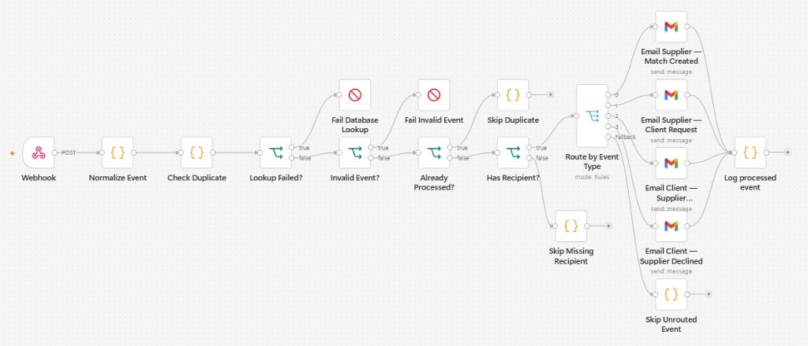

# NeoCube

AI-powered client–supplier matchmaking platform. Clients publish requirements, suppliers publish offerings, and a trained ranking pipeline stores scored matches with explanations, in-app notifications, RFQs, and quotations.

This is a working FastAPI + React application on **SQLite**. Matching is not category-only: hard business filters run first, then LSA semantic similarity, then a scikit-learn classifier trained from scratch on a **curated synthetic** dataset. That dataset is **not** historical company data.

## Problem statement

Procurement teams need more than keyword search. A supplier of “steel and aluminum mechanical parts” should be able to match “industrial metal components” when quantity, budget, delivery, and category constraints also hold. The platform stores every requirement, offering, match score, notification, RFQ, and quotation in the database and enforces RBAC on the backend.

## Architecture

```
Frontend (React / Vite)
    ↓ cookie session via Vite proxy
Backend API (FastAPI)
    ↓ services
SQLite (SQLAlchemy + Alembic)

Matching:
  client_requirements + supplier_offerings
    → hard constraint filter
    → LSA embeddings + cosine similarity
    → feature vector
    → trained sklearn model P(match=1)
    → ranked matches stored in `matches`
    → notifications (+ optional N8N webhook)
```

## Technology stack

| Layer | Technology |
| --- | --- |
| Frontend | React 18, React Router, Vite |
| Backend | Python, FastAPI, SQLAlchemy 2, Alembic, Pydantic |
| Auth | bcrypt passwords, signed HttpOnly cookie `neocube_session` |
| Database | SQLite (`sqlite:///./app.db`) |
| NLP | scikit-learn TfidfVectorizer (`char_wb` 3–5) + TruncatedSVD (64) |
| ML | Logistic Regression, Random Forest, Gradient Boosting (one selected by validation F1) |
| Documents | pypdf, python-docx (private `uploads/` storage) |
| Optional automation | N8N webhook (`N8N_WEBHOOK_URL`) |
| Tests | pytest |

Sentence-Transformers / PyTorch are **not** required at runtime. LSA is the production embedding path so the app stays installable without GPU/torch.

## Setup

### Backend

```bash
cd backend
python -m venv .venv
.venv\Scripts\activate
pip install -r requirements.txt
copy ..\.env.example .env
python scripts\train_match_model.py
uvicorn app.main:app --reload --port 8000
```

Tables are created on startup. Optional:

```bash
alembic upgrade head
```

### Frontend

```bash
cd frontend
npm install
npm run dev
```

Open `http://localhost:5173`. Vite proxies API routes to port 8000 so the session cookie stays first-party.

### Train the matching model

```bash
cd backend
.venv\Scripts\python.exe scripts\train_match_model.py
```

Writes:

- `backend/models/supplier_match_model_v1.joblib`
- `backend/models/lsa_encoder.joblib`
- `backend/models/model_metadata.json`
- `backend/models/feature_schema.json`
- `backend/ml_pipeline/data/curated_match_pairs.csv`
- `backend/ml_pipeline/eda/`

### AI Product Finder (optional vision CNN)

Isolated image-based supplier discovery. Independent of LSA/RF match scores. See `docs/AI_PRODUCT_FINDER.md`.

```bash
cd backend
.venv\Scripts\python.exe -m app.vision.build_dataset --per-class 40
.venv\Scripts\python.exe -m app.vision.train --epochs 8
.venv\Scripts\python.exe -m app.vision.evaluate
```

Disable with `AI_PRODUCT_FINDER_ENABLED=false`.

## Environment variables

Copy `.env.example` to `backend/.env`:

| Variable | Purpose |
| --- | --- |
| `DATABASE_URL` | default `sqlite:///./app.db` |
| `SECRET_KEY` | signs the session cookie; change outside local development |
| `COOKIE_SECURE` | `true` when serving HTTPS |
| `FRONTEND_ORIGIN` | CORS origin, default `http://localhost:5173` |
| `ENVIRONMENT` | `production` always sets cookie `Secure`; `test` disables auth rate limits |
| `UPLOAD_DIR` | private document storage |
| `MAX_UPLOAD_BYTES` | default `5000000` |
| `ADMIN_EMAIL` / `ADMIN_PASSWORD` | optional startup seed for a non-public ADMIN account |
| `MODEL_DIR` | default `models` |
| `AI_PRODUCT_FINDER_ENABLED` | optional vision feature; default `true` |
| `VISION_MODEL_DIR` | default `models/vision` |
| `VISION_DATASET_DIR` | default `vision_dataset` |
| `N8N_WEBHOOK_URL` | optional; leave empty if N8N is not running |

Never commit `.env`.

## Authentication

Public registration is **CLIENT** or **SUPPLIER** only. ADMIN cannot self-register; seed via env vars.

Login stores `user_id` in a signed HttpOnly cookie (`neocube_session`, SameSite=Lax, Secure in production). The frontend does not keep tokens in `localStorage`. Refresh calls `GET /users/me`.

Backend RBAC:

- CLIENT: own profile, requirements, matches, notifications, RFQs
- SUPPLIER: own profile, offerings, matches, notifications, RFQs
- ADMIN: summary counts and audit logs

IDOR: object endpoints return 404 when the row is not owned. Passwords are bcrypt hashes and are never returned.

## Client portal

Required fields: company/client name, product requirement, category, quantity, budget, location, delivery timeline, additional notes.

Statuses: `DRAFT` → `SUBMITTED` → `PROCESSING` / `MATCHED` → `RFQ_SENT` → `CLOSED` / `CANCELLED`. Invalid transitions are rejected on the backend.

Optional PDF/DOCX/TXT upload extracts candidate fields; the client must review and confirm. Failed extraction never fabricates values.

## Supplier portal

Required fields: supplier name, product offered, category, available quantity, pricing details, location, delivery capability, additional notes.

Statuses: `DRAFT`, `ACTIVE`, `UNAVAILABLE`, `EXPIRED`, `DEACTIVATED`. Only **ACTIVE** offerings with quantity > 0 and an active supplier user are eligible for matching.

Optional PDF/DOCX/TXT upload extracts candidate fields on `/supplier-documents`; the supplier must review and confirm. Creating an offering may attach `document_id` (owner-only). Failed extraction never fabricates values.

## Database

SQLite tables: `users`, `roles`, `client_profiles`, `supplier_profiles`, `categories`, `client_requirements`, `supplier_offerings`, `requirement_documents`, `supplier_documents`, `matches`, `notifications`, `rfqs`, `quotations`, `audit_logs`.

Migrations: `backend/alembic/versions/` (`001`–`005`). Existing SQLite files also receive additive columns via `ensure_sqlite_columns()` on startup.

## API

| Method | Path | Auth | Notes |
| --- | --- | --- | --- |
| GET | `/health` | no | process + model/encoder load status |
| POST | `/auth/register` | no | CLIENT or SUPPLIER |
| POST | `/auth/login` | no | HttpOnly cookie |
| POST | `/auth/logout` | no | |
| GET/PUT | `/users/me` | yes | |
| GET | `/categories` | yes | |
| GET/POST | `/requirements` | CLIENT | matching runs on submit |
| GET/PUT/DELETE | `/requirements/{id}` | CLIENT | owner only |
| GET/POST | `/offerings` | SUPPLIER | matching runs when ACTIVE |
| GET/PUT/DELETE | `/offerings/{id}` | SUPPLIER | owner only |
| POST/GET | `/documents` `/documents/{id}` | CLIENT | private files |
| POST/GET | `/supplier-documents` `/supplier-documents/{id}` | SUPPLIER | private files |
| GET | `/notifications` | yes | own rows |
| POST | `/notifications/{id}/read` | yes | owner only |
| GET/POST | `/rfqs` | CLIENT/SUPPLIER | create is CLIENT |
| GET | `/rfqs/{id}` | owner | supplier view marks VIEWED |
| POST | `/rfqs/{id}/quotations` | SUPPLIER | backend totals |
| GET | `/admin/summary` | ADMIN | live counts |
| GET | `/admin/audit-logs` | ADMIN | latest 50 |

## NLP

Production embeddings use a **fitted LSA pipeline** (`TfidfVectorizer` character word-boundary n-grams 3–5 + `TruncatedSVD` 64 dimensions), trained only on the training split of the curated dataset. Similarity is cosine, clipped to `[0, 1]`. If the encoder artifact is missing, similarity is `0` and matching still applies hard filters plus structured score.

## Dataset

See `backend/ml_pipeline/README.md`. There is **no** company historical match log in this repository. Labels are generated from documented business rules, not random assignment.

Trained `supplier_match_model_v1` (Random Forest, scikit-learn 1.6.1) on 446 curated development pairs (250 positive / 196 negative), split 312 / 67 / 67 train/val/test. Validation F1: logistic regression 0.96, random forest 0.9867, gradient boosting 0.9867. Random forest was selected on validation F1 (tied with gradient boosting; first highest wins). Held-out test: precision 1.0, recall 1.0, F1 1.0, ROC-AUC 1.0 on 67 rows. That perfect test score is a property of this small rule-labeled synthetic set (ratio features can recover the label rule); it is **not** production accuracy. When genuine company historical match data is available, replace `backend/ml_pipeline/data/curated_match_pairs.csv` or drop in `company_match_pairs.csv` (same schema) and retrain. Read `backend/models/model_metadata.json` after retraining.

## Matching algorithm

1. Load ACTIVE supplier offerings (quantity > 0, active user).
2. Drop pairs that fail hard constraints (category, quantity, parseable budget, parseable delivery).
3. Embed requirement and offering text; cosine similarity.
4. Build the same 5 numeric features used in training.
5. ML probability from `supplier_match_model_v1`.
6. Structured score from constraint flags + location overlap.
7. Rank remaining suppliers by the trained model `P(match=1)` (`final_score`). Semantic cosine is a model input, not the match by itself.
8. Store component scores, explanations, and `model_version`.
9. Notify client and supplier; optional N8N webhook.

Explanations are only emitted when the corresponding check is true (for example “Within budget” only if estimated cost ≤ budget, “Location compatible” only if location tokens overlap).

If a requirement or offering changes, matches are recomputed. RFQ/accepted matches are not overwritten.

## Delivery feasibility

Delivery feasibility is determined only from declared days versus required days:

- Client required delivery = X days
- Supplier declared delivery = Y days
- If Y ≤ X, the supplier passes the delivery-time requirement
- If Y > X, the supplier fails the hard filter and is not an eligible match

Location remains a separate matching and display factor (client location, supplier location, location compatibility). Geographical distance is not converted into a delivery-time estimate. Google Maps route-transit is not used.

See `docs/DELIVERY.md`.

## Notifications

Rows in `notifications` (unread/read, type, related entity, timestamp). Created on match, RFQ, quotation, and unmatched submission. Frontend toasts are not used as a substitute.

## N8N

N8N is **optional** for matching and RFQs. If `N8N_WEBHOOK_URL` is set, the backend POSTs structured events (`MATCH_CREATED`, `CLIENT_REQUEST_SENT`, `SUPPLIER_ACCEPTED`, `SUPPLIER_DECLINED`) to that backend-only URL after the corresponding business event is committed. Recipients come from registered `users.email` values (`supplier_email` / `client_email`). Import `n8n/client-supplier-notification-hub.json` into n8n (replace the Data Table **Get Row By ID** duplicate check). If the URL is empty, n8n is down, or the webhook errors, matching, RFQs, and in-app notifications still succeed. See `docs/N8N.md`.

This is the production n8n workflow currently used by NeoCube:



```
Webhook
  → Normalize Event
  → Check Duplicate
  → Already Processed?
  → Has Recipient?
  → Route by Event Type
      MATCH_CREATED        → Email Client — Match Created
      CLIENT_REQUEST_SENT  → Email Supplier — Client Request
      SUPPLIER_ACCEPTED    → Email Client — Supplier Accepted
      SUPPLIER_DECLINED    → Email Client — Supplier Declined
  → Log processed event
```

## RFQ and quotations

Client selects a stored match and creates an RFQ. Supplier views it and submits a quotation. Totals are computed on the backend:

`subtotal = unit_price * quantity`  
`total = subtotal + shipping + tax + additional_charges`

Frontend-calculated totals are not trusted.

## Testing

```bash
cd backend
.venv\Scripts\python.exe -m pytest -q
cd frontend
npm run build
```

There is no separate frontend unit-test runner in this repo. Backend pytest covers auth, RBAC, IDOR, portals, documents, NLP, ML loading, matching, notifications, RFQ, and quotations.

## Security

- bcrypt passwords; never returned
- HttpOnly session cookie; CORS limited to `FRONTEND_ORIGIN`
- backend role checks and owner checks
- auth rate limit (skipped when `ENVIRONMENT=test`)
- uploads validated by extension/MIME/size; stored privately; not served as static files
- generic 500 responses (no stack traces to clients)
- secrets belong in `.env`, which is gitignored

## Deployment

Run the backend with uvicorn/gunicorn, serve `frontend/dist`, point `FRONTEND_ORIGIN` at the real origin, set `ENVIRONMENT=production`, `COOKIE_SECURE=true`, a strong `SECRET_KEY`, and keep `uploads/` and `app.db` off the public web root. Train or copy `backend/models/` artifacts onto the server.

Optional Docker (SQLite volume, not a hosted N8N):

```bash
docker compose up --build
```

The compose file publishes the API on port 8000 and nginx on 5173. Nginx now reverse-proxies API paths (`/auth`, `/requirements`, `/health`, and the other backend prefixes) to the backend service so browser `fetch("/...")` calls work from the nginx origin. Configure `FRONTEND_ORIGIN=http://localhost:5173` (already the compose default). `N8N_WEBHOOK_URL` is still optional. Docker Compose itself was not executed in the last verification pass.

## Limitations

- SQLite is the production database in this project (not PostgreSQL).
- NLP is LSA, not a transformer embedding model.
- Training data is curated/synthetic, not company history.
- N8N is webhook-only and inactive until `N8N_WEBHOOK_URL` is set.
- No Playwright/Cypress E2E harness; pytest covers the same business path.
- Certification is a hard filter parsed from requirement `additional_notes` (for example “ISO 9001 certification required”) against supplier notes; it is not a dedicated form field.
